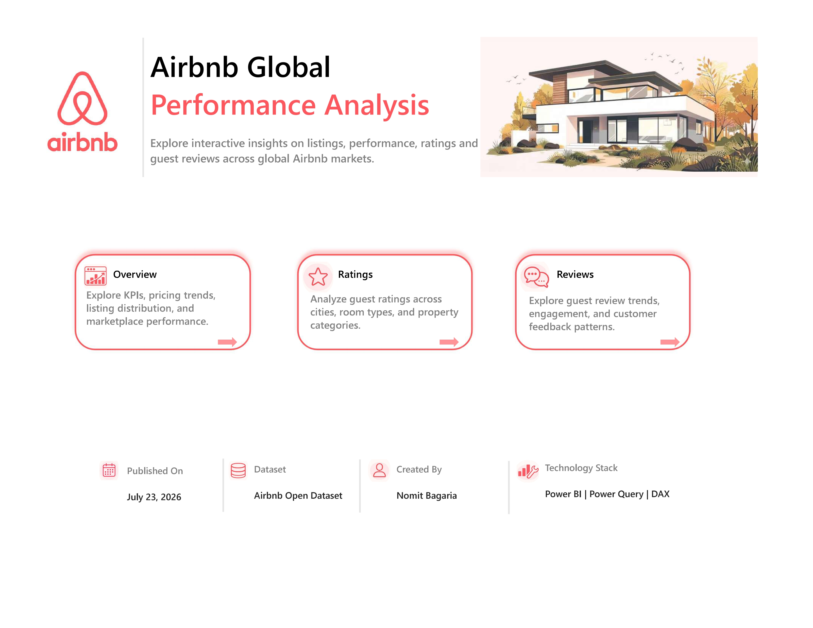
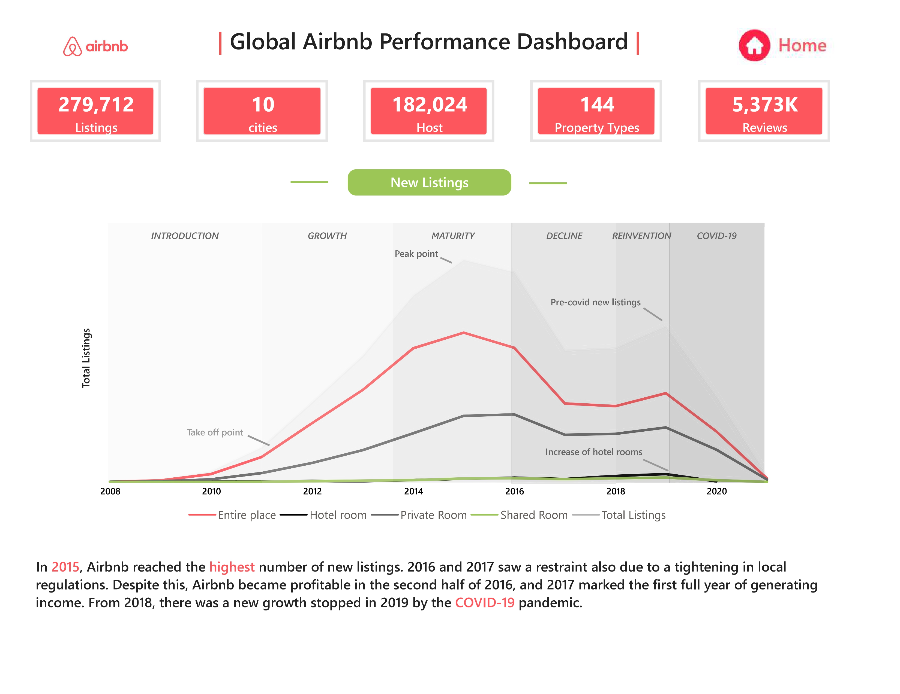
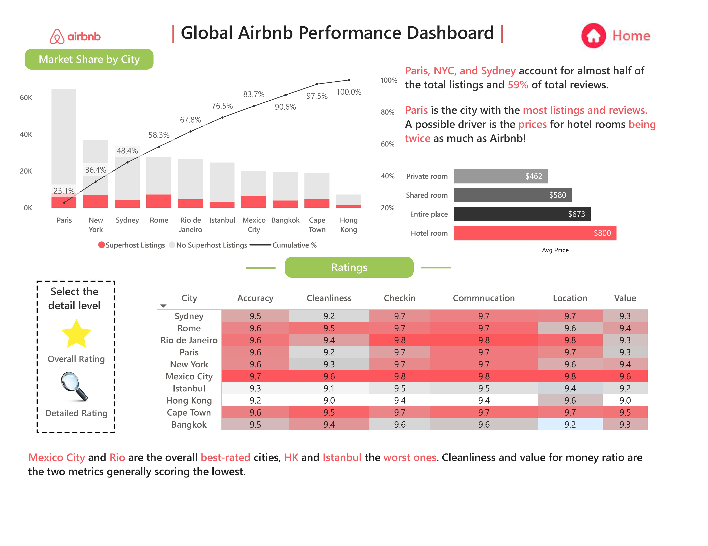
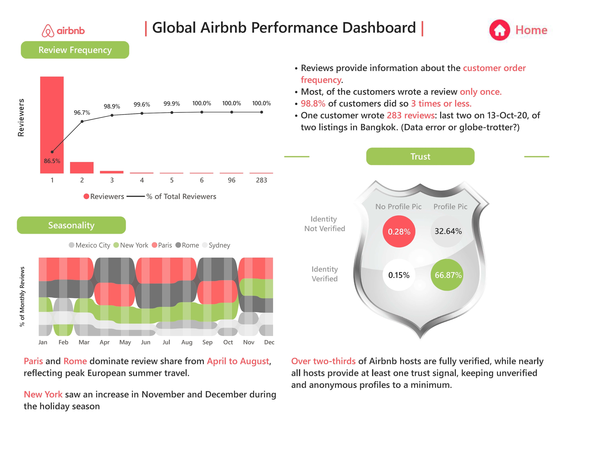

<div align="center">

# 🏡 Airbnb Global Performance Analysis

### An Interactive Business Intelligence Dashboard Built with Power BI

<p>


</p>

**Power BI • Power Query • DAX • Data Modelling • Dashboard Design • Business Intelligence • Data Storytelling**

</div>

---
## 🚀 Live Interactive Dashboard

<p align="center">
  <a href="https://app.powerbi.com/view?r=eyJrIjoiZDU5MjY5MTMtOWJhMC00ODFkLWFmZDMtYzZmN2JjMzRiNjg4IiwidCI6ImY3ODUyYjcxLWM5OTItNDJhOS1iZTBkLTJkZWFmZjFhYzUyMCJ9&pageName=6b9b2dcb6ed9642d09da" target="_blank">
    
  </a>
</p>

<p align="center">
  <b>👆 Click the dashboard preview above to explore the fully interactive Power BI report.</b>
</p>

---

# 📌 Project Highlights

- 📊 Interactive Business Intelligence Dashboard
- 🌍 Analysis of **279K+ Airbnb Listings**
- ⭐ Analysis of **5.3 Million Customer Reviews**
- 🏙️ Covers **10 Global Cities**
- 📈 Business-focused Visualisations
- 🎯 Interactive Navigation using Bookmarks
- 📖 Data Storytelling through Business Insights

---

# 📖 About the Project

This project presents an interactive Power BI dashboard developed to analyse Airbnb marketplace performance across multiple global cities.

The analysis explores marketplace growth, pricing behaviour, customer ratings, review trends, host trust indicators, and seasonal demand patterns to demonstrate how business intelligence can support data-driven decision-making.

Rather than focusing only on visualisation, the project emphasises presenting analytical findings in a clear, structured, and business-oriented manner.

---

# 🎯 Business Objective

The primary objective of this project is to analyse Airbnb marketplace data and answer business questions related to:

- Marketplace Growth
- Listing Distribution
- Pricing Behaviour
- Customer Satisfaction
- Host Credibility
- Review Behaviour
- Seasonal Demand Trends

The dashboard enables users to interactively explore marketplace performance and identify meaningful business insights.

---

# 📊 Dataset Overview

The analysis is based on a publicly available Airbnb dataset containing information about:

- Listings
- Hosts
- Reviews
- Ratings
- Room Types
- Property Types
- Pricing
- Cities

### Dataset Summary

| Metric | Value |
|----------|-------|
| Listings | 279,712+ |
| Reviews | 5.3 Million+ |
| Cities | 10 |
| Analysis Period | 2008 – 2021 |

---

# 🔄 Project Workflow

```text
Raw Dataset
      │
      ▼
Power Query
      │
      ▼
Data Cleaning & Transformation
      │
      ▼
Data Modelling
      │
      ▼
DAX Measures
      │
      ▼
Interactive Dashboard
      │
      ▼
Business Insights
```

---

# 📑 Dashboard Pages

## 🏠 Home Page

Provides a central navigation page allowing users to access different analytical sections of the dashboard through an interactive interface.

<p align="center">

</p>

<p align="center">
<b>The landing page provides intuitive navigation to each analytical section of the dashboard.</b>
</p>

## 📈 Business Overview

Provides a high-level summary of Airbnb marketplace performance through key performance indicators and listing trends.

### Analysis Included

- Marketplace KPIs
- Listing Growth
- Room Type Distribution
- Historical Platform Timeline
- Overall Marketplace Performance

<p align="center">

</p>

<p align="center">
<b>Executive overview highlighting marketplace KPIs, listing growth trends, and room type distribution.</b>
</p>
---

## ⭐ Ratings Analysis

Analyses customer satisfaction and pricing behaviour across different cities and property types.

### Analysis Included

- Overall Ratings
- Detailed Rating Breakdown
- City-wise Ratings
- Price Comparison
- Market Share Analysis
- Superhost Analysis

<p align="center">

</p>

<p align="center">
<b>Explore guest ratings, pricing patterns, city performance, and market concentration across Airbnb markets.</b>
</p>
---

## 💬 Customer & Review Analysis

Examines customer engagement patterns and host trust indicators.

### Analysis Included

- Review Distribution
- Customer Review Behaviour
- Host Verification
- Trust Indicators
- Seasonal Review Trends


<p align="center">

</p>

<p align="center">
<b>Analyze guest review behaviour, host trust indicators, and seasonal review trends.</b>
</p>
---

# 💡 Key Business Insights

The dashboard highlights several important marketplace observations, including:

- Marketplace growth trends over time.
- Distribution of listings across major global cities.
- Pricing differences across room types.
- Customer satisfaction across different markets.
- Seasonal variation in customer review activity.
- Host verification and trust patterns.

---

# 🛠️ Skills Demonstrated

Through this project, I strengthened my practical understanding of:

- Power BI Dashboard Development
- Data Cleaning using Power Query
- Data Modelling
- DAX Measures
- KPI Design
- Business Intelligence Reporting
- Interactive Navigation
- Bookmark Navigation
- Dashboard Design
- Business Storytelling
- Data Visualisation Best Practices

---

# 💻 Tools & Technologies

- Microsoft Power BI
- Power Query
- DAX (Data Analysis Expressions)
- Data Modelling
- Data Visualisation

---

# ▶️ How to Use

1. Click on the **Live Interactive Dashboard** preview at the top of this repository.
2. The Power BI report will open in your web browser.
3. Navigate through the report using the interactive Home page.
4. Explore each dashboard page using the built-in navigation buttons and filters.
5. Hover over visuals where applicable to view additional information.

---

# 📂 Dataset Source

The dataset used in this project is publicly available for learning and analytical purposes.

➡️ **Dataset Source:** *https://mavenanalytics.io/data-playground/airbnb-listings-reviews*

---

# 🙏 Acknowledgements

This project was completed as part of a guided Power BI learning journey to strengthen my skills in data modelling, dashboard development, DAX, and business intelligence.

I would like to thank **[Mansi Goel](https://www.linkedin.com/in/mansigoelofficial/)** for the instructional guidance provided throughout the project.

📺 **Original Learning Resource:** [YouTube Tutorial](https://youtu.be/LzlaCBNT9vY?si=O0sbVRltuXTBhv1M)

The dashboard customisation, documentation, project organisation, GitHub presentation, and portfolio preparation were completed independently as part of my learning process.

---

<div align="center">

## 👤 Connect With Me

**Nomit Bagaria**

💼 LinkedIn: www.linkedin.com/in/nomitbagaria


</div>
